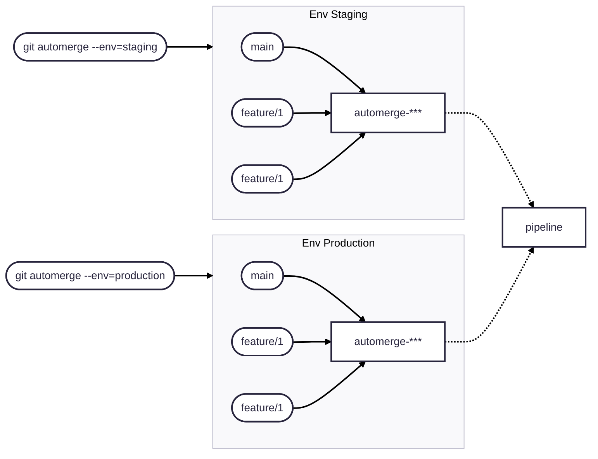

# Git AutoMerge

[](https://git-automerge.github.io/)

**Git AutoMerge** is a CLI tool to automate merging multiple remote Git branches into a temporary branch, tagging that branch with an environment-specific tag, pushing the tag to origin, and cleaning up afterward.

---

## Features

- Reads configuration from a YAML file defining multiple environments
- Supports read the configuration YAML from origin default branch
- Supports wildcard patterns for included remote branches to merge
- Creates a temporary branch from a base branch before merging
- Tags the merge commit with an environment name and timestamp
- Pushes the tag to the remote repository
- Automatically cleans up the temporary branch and local tag
- Supports optional customizable tag prefix per environment

---

## Installation

Via curl
```bash
curl -sSL https://raw.githubusercontent.com/git-automerge/automerge/main/install.sh | sudo bash
```

Via wget
```bash
wget -qO - https://raw.githubusercontent.com/git-automerge/automerge/main/install.sh | sudo bash
```

Download directly
```bash
curl -L https://github.com/git-automerge/automerge/blob/main/bin/git-automerge -o /usr/local/bin/git-automerge
chmod +x /usr/local/bin/git-automerge
```

Add `.tmp_automerge-config.yaml` to the .gitignore

## Usage

```bash
git automerge --help
```

## Configuration Example (automerge-config.yaml)

Create a automerge-config.yaml file in your project root with this structure:
```yaml
config_source: origin/main:automerge-config.yaml # Optional; Read config from remote branch

envs:
  staging:
    base: main
    branches:
      - "bugfix/*"
    tag_prefix: "prod-"      # Optional; Default is "automerge-" if empty or false, no prefix used

  feature:
    base: develop
    branches:
      - "feature/*"
    tag_prefix: false # omitted here; no prefix will be used
```

## The script will:

- Check your working directory is clean.
- Fetch all remote branches.
- Create a temporary branch from the base branch.
- Merge all matching remote branches.
- Push mode option for "tag" or "branch"
- Tag the commit with a timestamp and environment name.
- Push the tag to the remote.
- Clean up local temporary branch and tag, and restore your original branch.



## Remote vs. local config

By default, git-automerge reads its configuration from a local `automerge-config.yaml` file. However, this can create inconsistencies if developers run the tool from different branches with outdated or incomplete config files.

To solve this, you can define a remote config source using the `config_source` option at the top level of your config file.

🔒 Consistency: Always uses the canonical config from the main branch, even when running the tool on a feature branch.

🌐 Centralized Control: Ensures all developers and CI runners use the same rules for branching, tagging, and merging.

🔄 Dynamic Updates: Changes to the config take effect immediately without requiring a rebase or manual update on local clones.


### When config_source is defined:

- The local config file is read first.
- If config_source is set, the script fetches the config from the specified Git reference (e.g. origin/main:automerge-config.yaml) using git show.
- The fetched config replaces the local one for the current operation.
- If config_source is missing or empty, the local config is used as fallback.
